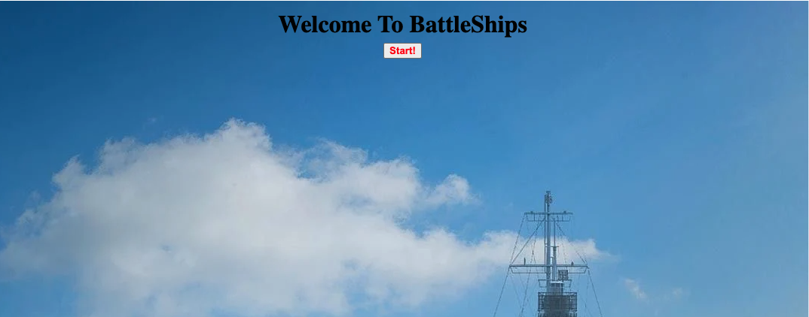

<h1>
Recreation of BattleShips v1
      
by Aamer Shikari
</h1>

The premise of the game is to eliminate all enemy ships before yours
are taken down. All ship locations for the enemy are hidden and randomly 
generated at the start of each round, while player ships must be placed 
onto the board. 

Throughout the game the coordinates of each launched attack are displayed
and hints as to the logic behind the AI's intentions can be given at 
the highest difficulty.

<h2>Features include: </h2>
<ul>
     <li> AI opponents with varying difficulties </li>
     <li>Customization of player board </li>
     <li>Sound effects on collision </li>
     <li>Infinite gameplay! </li>
<ul>

<h2>Here's what it looks like! </h2>

Start Screen 

Difficulty Selection  

Gameplay! 

End Game Screen  

<h2>Technology Used: </h2>
<ul>
     <li>JavaScript</li>
     <li>HTML</li>
     <li>CSS</li>
<ul>
     
<h2> Here's the Game! </h2>
[BattleShips](https://AamerShikari.github.io/BattleShips/)
